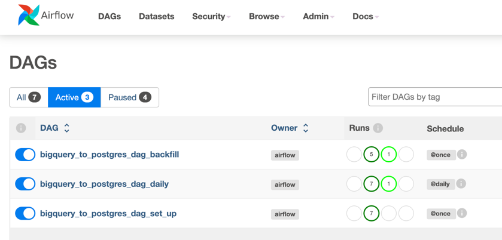
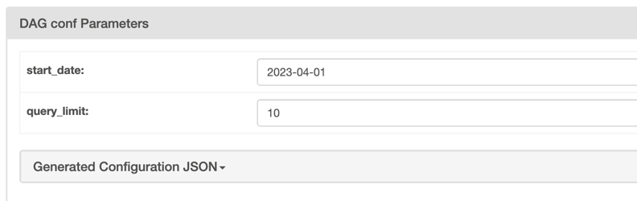
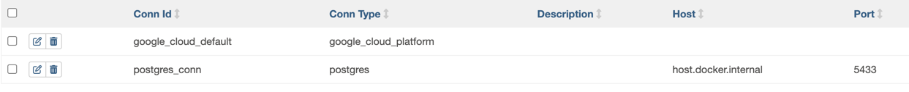

# Cryptocurrency Data Engineering Project

## Architecture

Project consists of 3 pipelines:
1. `bigquery_to_postgres_dag_set_up` - Dag to set up needed components, like GCS bucket, postgres db, etc. It automatically
triggers the next dag to load historical data `bigquery_to_postgres_dag_backfill`. Input JSON params here to specify particular `start_date`
and `query_limit` (prevention step for testing purposes)

2. `bigquery_to_postgres_dag_backfill` - Dag to load historical data. It is triggered by the first dag and loads data from JSON param 
obtained from the set-up dag
3. `bigquery_to_postgres_dag_daily` - Dag to load daily data. It is triggered by the backfill dag and runs daily

## Reasoning
1. I've thought to implement only daily dag with `catchup=True`, but considering the performance, I've decided to
swicth to a separate backfill dag to load data in bulk and then triggering daily runs dag.

2. I've decided to use GCS as a data lake to store cleaned up + unduplicated data.
I've tried to implement it first with `BaseSQLToGCSOperator`, but it was taking too much time,
so I've switched to combination of `BigQueryExecuteQueryOperator` and `BigQueryToGCSOperator`:
tradeoff here is one extra step for loading data into BQ staging table and only after copying to
data lake.

3. I've kept data lake files stored, but it's definetely TBD, as considering blockchain data quite
stale, I don't see many reasons to bulking it up + it's less cost. I'd better keep only currently running files
in the future.

4. Question of idempotency - atm, we are dropping all the rows if the same datestamp was found and 
inserting new ones. However, we might swicth to write-only-no-updates approach, but it's TBD.


## Prerequisites   

To use the template, please install the following. 

1. [git](https://git-scm.com/book/en/v2/Getting-Started-Installing-Git)
2. [Github account](https://github.com/)
4. [GCP account](https://gcp.com/) 
6. [Docker](https://docs.docker.com/engine/install/) with at least 4GB of RAM and [Docker Compose](https://docs.docker.com/compose/install/) v1.27.0 or later

Local Postgres DB is used for spin within docker container

### Setup infra

Run the following commands in your project directory.

```shell
python3 -m venv ethvenv
source ethvenv/bin/activate
docker-compose build # build the docker containers on your computer
docker-compose up # spin up the docker containers
```

#### Set up connections

`postgress_conn`
```
host: host.docker.internal
schema: crypto
login: crypto
password: crypto
```

`google_cloud_default`
```angular2html
keyfile_json: COPY_FROM_GCP
```


### Testing
to run the tests
```shell
pipenv run pytest -v tests/test_utils.py -vv
```


